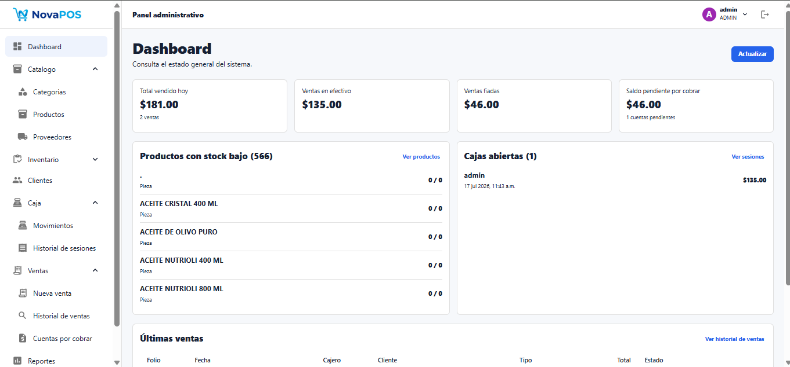
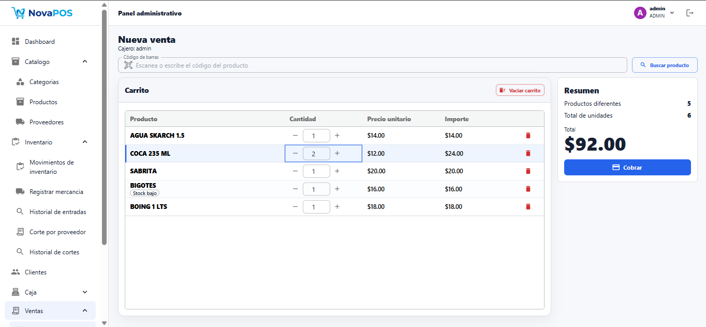
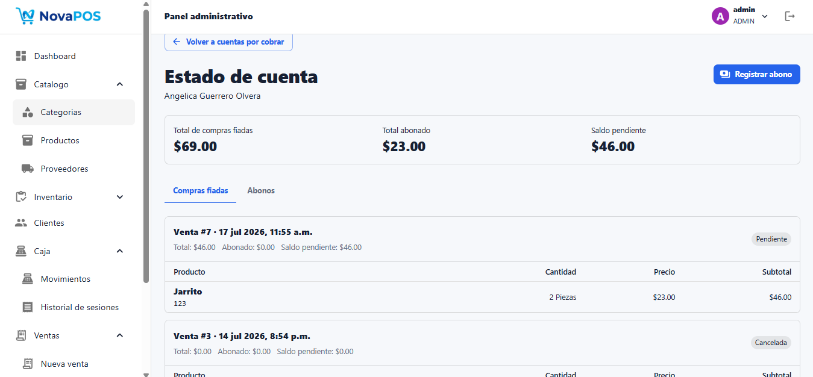
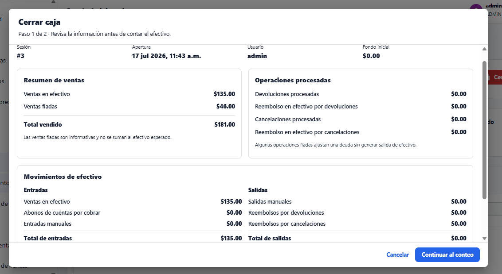
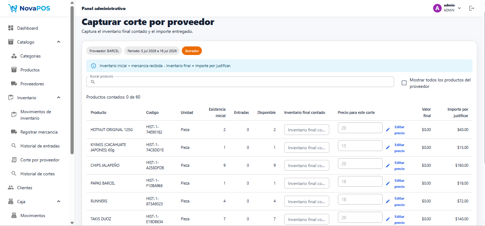
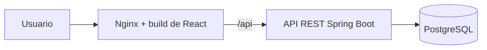

# NovaPOS

[English](README.md) | [Español](README.es.md)

NovaPOS es un sistema full stack de punto de venta, inventario y control operativo para una tienda familiar o pequeño comercio. Moderniza un flujo de trabajo local que anteriormente dependía de una aplicación de escritorio Java Swing y hojas de cálculo, reconstruyéndolo con Spring Boot, React, PostgreSQL y Docker.

Estado actual: aplicación funcional en desarrollo activo. El proyecto incluye actualmente los principales flujos de tienda, despliegue local con Docker, scripts operativos en PowerShell, pruebas backend automatizadas, verificación del frontend mediante lint/build y documentación técnica.

## Vista previa de la aplicación

| Dashboard del administrador | Registro de venta |
| --- | --- |
|  |  |

| Cuentas por cobrar | Cierre de caja |
| --- | --- |
|  |  |

### Corte de proveedor



## Problema que resuelve

Las tiendas pequeñas necesitan registrar ventas, controlar existencias, administrar caja, dar seguimiento a ventas fiadas, registrar abonos y gestionar mercancía de proveedores sin depender de hojas de cálculo dispersas o cálculos manuales. NovaPOS centraliza estos flujos en una aplicación web local que puede ejecutarse con Docker en la computadora de la tienda.

NovaPOS ejecuta el frontend, el backend y la base de datos localmente mediante Docker. Las operaciones principales no requieren conexión a Internet mientras Docker Desktop y los contenedores estén funcionando. Nginx sirve el build de React y reenvía `/api` al backend Spring Boot, mientras PostgreSQL almacena los datos operativos localmente. La aplicación no es una PWA y no puede operar cuando sus servicios locales están detenidos.

## Puntos destacados

- Migra un flujo POS desarrollado en Java Swing hacia una arquitectura web con API REST y frontend React.
- Usa un backend Spring Boot organizado por features, con DTOs, servicios, repositorios, MapStruct, Bean Validation, Flyway y manejo global de errores.
- Usa un frontend React y TypeScript organizado por features, con hooks, casos de uso, repositorios, Material UI, AG Grid, React Hook Form y Zod.
- Aplica autenticación JWT, autorización por roles, cambio obligatorio de contraseña y permisos de negocio controlados por el backend.
- Maneja ventas transaccionales, movimientos de inventario, sesiones de caja, cuentas por cobrar, registro de mercancía y cortes de proveedor.
- Soporta búsqueda por código de barras con productos locales y consulta opcional a Open Food Facts cuando el producto no está registrado localmente.
- Incluye ejecución local con Docker, despliegue local de producción con Nginx, procedimientos de respaldo y restauración de PostgreSQL, Swagger/OpenAPI en desarrollo y pruebas backend automatizadas.

## Funcionalidades principales

### Ventas e inventario

- Ventas de contado y fiadas con búsqueda de productos por código de barras.
- La búsqueda por código de barras revisa primero el catálogo local y puede consultar Open Food Facts para códigos numéricos no registrados.
- Los resultados de Open Food Facts se usan como sugerencias editables de nombre, marca y presentación durante la creación de productos y la recepción de mercancía.
- Historial y detalle de ventas, cancelaciones y devoluciones de productos.
- Actualización de stock mediante ventas, devoluciones, cancelaciones, entradas de proveedor, cortes de proveedor y movimientos manuales de inventario.
- Catálogo de productos con categorías, precios, stock, stock mínimo, estado activo, relación con proveedores y visualización de productos con bajo stock en el dashboard.

La consulta externa por código de barras tiene un alcance limitado. NovaPOS no crea productos automáticamente desde Open Food Facts; solo propone datos que la persona operadora puede revisar y editar antes de guardar. Si el producto ya existe localmente, el sistema informa el producto existente para evitar duplicados. Si el servicio externo no está disponible o el código no se encuentra, el producto puede capturarse manualmente. Esta consulta requiere Internet, pero los flujos principales del punto de venta siguen funcionando sin Internet mientras Docker Desktop y los contenedores locales estén activos.

### Caja

- Apertura de caja para operadores de tienda.
- Entradas y salidas manuales de efectivo.
- Resumen de la caja actual, cálculo de efectivo esperado, cierre de caja e historial de sesiones.
- Las sesiones cerradas conservan totales históricos, efectivo contado, diferencias, notas y operaciones procesadas.

### Clientes y crédito

- Administración de clientes para ventas de contado y fiadas.
- Las ventas fiadas generan cuentas por cobrar.
- Consulta de saldos pendientes, detalle de cuenta por cliente, registro de abonos e historial de pagos.
- Ajustes de cuentas por cobrar mediante devoluciones o cancelaciones permitidas.

### Proveedores

- Administración de proveedores y relación entre productos y proveedores.
- Inventario inicial por proveedor, recepción de mercancía, detalle histórico de entradas y cortes de proveedor.
- Cortes en borrador y finalizados, soporte para importación histórica y exportación a Excel de cortes finalizados.
- Fórmula del corte:

```text
Importe por justificar = inventario inicial + mercancía recibida - inventario final
```

Los valores históricos de proveedor se conservan y no se recalculan utilizando los precios actuales de los productos.

### Administración y seguridad

- Roles `ADMIN` y `CASHIER`.
- Autenticación JWT y autorización por roles en el backend.
- Administración de usuarios, usuarios activos e inactivos, cambio de contraseña y flujo de cambio obligatorio.
- Swagger UI habilitado únicamente con el perfil de desarrollo.

### Dashboard y reportes

- Dashboard adaptado al rol para usuarios `ADMIN` y `CASHIER`.
- Resumen diario de ventas, totales de contado y crédito, cuentas por cobrar, productos con bajo stock, cajas abiertas y ventas recientes.
- Endpoint y pantalla de reporte operativo para revisión administrativa.

### Operación local

- Stack de desarrollo con Docker Compose.
- Stack local de producción con PostgreSQL, Spring Boot, build de React servido por Nginx y únicamente el frontend publicado al host.
- Scripts PowerShell para instalación, inicio, detención, estado, logs, respaldo, restauración, actualización y creación de accesos directos.
- Respaldos PostgreSQL en formato `.dump`, creados con `pg_dump -Fc` y restaurados con `pg_restore`.

## Limitaciones actuales

- No están configuradas pruebas automatizadas del frontend ni pruebas end-to-end.
- No está configurada la integración continua (CI).
- La aplicación no ofrece funcionamiento PWA ni modo offline del navegador.
- El despliegue actual está diseñado para una sola tienda local.

## Tecnologías

| Área | Tecnologías confirmadas |
| --- | --- |
| Backend | Java 17, Spring Boot 4.1.0, Spring Web MVC, Spring Data JPA, Spring Security, JWT con JJWT 0.13.0, PostgreSQL, Flyway, MapStruct 1.6.3, Bean Validation, Springdoc OpenAPI 3.0.3, JUnit, Spring Boot Test y Mockito. |
| Frontend | React 19.2.7, TypeScript 6.0.2, Vite 8.1.1, Material UI 9.2.0, AG Grid 36.0.0, React Hook Form 7.81.0, Zod 4.4.3, Axios 1.18.1 y Oxlint. |
| Infraestructura | Docker, Docker Compose, PostgreSQL 16, Nginx 1.27 Alpine para el despliegue local de producción y PowerShell para scripts operativos en Windows. |
| Procesamiento de archivos | Apache POI 5.4.1 para importación histórica y exportación a Excel de cortes de proveedor. |

## Arquitectura

NovaPOS es un monorepo que contiene un backend Spring Boot, un frontend React, configuración Docker, scripts operativos y documentación. El backend está organizado por feature con capas de controlador, servicio, repositorio, entidad, DTO, mapper y excepciones. El frontend también está organizado por feature y separa responsabilidades de dominio, aplicación, infraestructura y UI.

Los cálculos de negocio se realizan en el backend. El frontend consume los resultados mediante este flujo:

```text
UI -> Hook -> Use Case -> Repository -> HTTP Client
```



En desarrollo, PostgreSQL puede ejecutarse en Docker mientras el backend y el frontend se ejecutan directamente con Maven y Vite. En el entorno local de producción, Docker Compose inicia `db`, `backend` y `frontend`; únicamente Nginx publica un puerto en la computadora.

## Roles de usuario

| Rol | Alcance confirmado |
| --- | --- |
| `ADMIN` | Administra usuarios, catálogos, inventario, proveedores, reportes, historial de sesiones de caja, cuentas por cobrar y operaciones administrativas. |
| `CASHIER` | Opera los flujos de caja permitidos, ventas, clientes y acciones autorizadas por el backend. No tiene acceso a proveedores, reportes administrativos ni inventario administrativo. |

El backend es la fuente de verdad para los permisos mediante Spring Security. Las protecciones de rutas del frontend solo mejoran la navegación y la experiencia del usuario.

## Reglas de negocio principales

- Las ventas de contado requieren una caja abierta.
- Las ventas fiadas requieren un cliente y generan una cuenta por cobrar.
- Los abonos requieren una caja abierta y no pueden superar el saldo pendiente.
- Las devoluciones y cancelaciones restauran inventario de acuerdo con la operación correspondiente.
- Las ventas con devoluciones no pueden cancelarse y las ventas fiadas con pagos tampoco pueden cancelarse.
- Las sesiones de caja cerradas no pueden recibir nuevas operaciones.
- Los cortes de proveedor finalizados no pueden editarse.
- Los registros históricos de ventas y proveedores no se recalculan utilizando los precios actuales de los productos.

## Inicio rápido

Docker Compose carga la configuración desde el archivo `.env` de la raíz, creado a partir de `.env.example`. Reemplaza las credenciales de base de datos y JWT antes de utilizar el sistema con datos reales y nunca subas secretos al repositorio. La ejecución directa con Maven y Vite puede requerir variables de entorno o configuración específica de cada proyecto, como se explica en [Desarrollo local](docs/development.md).

Las variables principales incluyen `DB_NAME`, `DB_USER`, `DB_PASSWORD`, `JWT_SECRET`, `JWT_EXPIRATION_MINUTES`, `SPRING_PROFILES_ACTIVE`, `VITE_API_BASE_URL`, `BOOTSTRAP_ADMIN_*` y `OPEN_FOOD_FACTS_*`.

### Desarrollo

Iniciar PostgreSQL:

```bash
docker compose up -d db
```

Iniciar el backend:

```bash
cd pos-backend
./mvnw spring-boot:run -Dspring-boot.run.profiles=dev
```

Iniciar el frontend:

```bash
cd pos-frontend
npm ci
npm run dev
```

Para ejecutar directamente el backend y el frontend, asegúrate de que la configuración requerida esté disponible como se explica en la guía de desarrollo.

### Stack completo de desarrollo con Docker

```bash
cp .env.example .env
docker compose -f docker-compose.yml -f docker-compose.dev.yml up -d --build
```

Windows PowerShell:

```powershell
Copy-Item .env.example .env
docker compose -f docker-compose.yml -f docker-compose.dev.yml up -d --build
```

| Servicio | URL |
| --- | --- |
| Frontend | `http://localhost:5173` |
| URL base de la API | `http://localhost:8080/api` |
| PostgreSQL | `localhost:5433` |
| pgAdmin | `http://localhost:5051` |

Comandos útiles de Docker:

```bash
docker compose -f docker-compose.yml -f docker-compose.dev.yml ps
docker compose -f docker-compose.yml -f docker-compose.dev.yml logs -f backend
docker compose -f docker-compose.yml -f docker-compose.dev.yml down
```

Para operar NovaPOS en una computadora Windows con contenedores locales de producción, consulta la [guía de despliegue local de producción](docs/store-deployment.md).

## Documentación de la API

Swagger UI y los endpoints de OpenAPI están disponibles únicamente cuando el backend se ejecuta con el perfil `dev`.

| Recurso | URL |
| --- | --- |
| Swagger UI | `http://localhost:8080/swagger-ui.html` |
| OpenAPI JSON | `http://localhost:8080/v3/api-docs` |
| OpenAPI YAML | `http://localhost:8080/v3/api-docs.yaml` |

Autentícate mediante `POST /api/auth/login` y utiliza el JWT devuelto con el esquema Bearer configurado. Los contratos completos de solicitudes y respuestas, metadatos de validación y errores están disponibles mediante Swagger UI y los endpoints OpenAPI JSON/YAML.

## Pruebas

Las pruebas backend cubren comportamiento de servicios y controladores para ventas, movimientos de caja, sesiones de caja, movimientos de inventario, cuentas por cobrar, abonos, resúmenes del dashboard, reportes, proveedores y exportación a Excel de cortes de proveedor.

```bash
cd pos-backend
./mvnw clean verify
```

La verificación del frontend utiliza lint y el build de producción.

```bash
cd pos-frontend
npm run lint
npm run build
```

Actualmente el proyecto no incluye pruebas automatizadas del frontend, pruebas end-to-end, CI ni reportes de cobertura.

## Documentación

- [Índice de documentación técnica](docs/README.md)
- [Arquitectura](docs/architecture.md)
- [Backend](docs/backend.md)
- [Frontend](docs/frontend.md)
- [Base de datos](docs/database.md)
- [API](docs/api.md)
- [Reglas de negocio](docs/business-rules.md)
- [Seguridad](docs/security.md)
- [Desarrollo local](docs/development.md)
- [Pruebas](docs/testing.md)
- [Guía de usuario](docs/user-guide.md)
- [Despliegue local de producción](docs/store-deployment.md)
- [Respaldos y restauración](docs/backup-restore.md)
- [Decisiones técnicas](docs/technical-decisions.md)
- [Caso de portafolio](docs/portfolio-case-study.md)
- [Importación histórica](docs/legacy-import.md)

## Estructura del repositorio

```text
.
├── pos-backend/
├── pos-frontend/
├── docs/
├── scripts/
├── docker-compose.yml
├── docker-compose.dev.yml
├── docker-compose.prod.yml
├── .env.example
├── README.md
└── README.es.md
```

## Alcance del proyecto

- Diseñado para una tienda minorista pequeña.
- Pensado para instalación y operación local.
- Soporta ventas de contado y fiadas.
- Soporta procedimientos locales de respaldo y restauración de PostgreSQL.
- No incluye soporte para múltiples sucursales.
- No incluye integración con pagos con tarjeta ni pagos en línea.
- No ofrece funcionamiento PWA ni modo offline del navegador; los servicios locales deben estar activos.
- Los datos históricos importados pueden conservar inconsistencias provenientes de hojas de cálculo heredadas.

## Aplicación de escritorio anterior

NovaPOS es una migración y rediseño del [sistema de punto de venta original en Java Swing](https://github.com/AngelicaGuerOl/PointOfSaleSystem). La nueva versión incorpora API REST, frontend React, PostgreSQL, migraciones Flyway, autenticación JWT, Docker Compose, despliegue local de producción con Nginx, scripts operativos en PowerShell y documentación OpenAPI.

## Roadmap

- Impresión de tickets.
- Pruebas automatizadas del frontend.
- Pruebas end-to-end para ventas, caja e inventario.
- GitHub Actions para build y verificación.
- Mejoras de seguridad operativa y auditoría.

## Licencia

Este repositorio no tiene una licencia seleccionada. El código fuente se publica para su revisión como proyecto de portafolio y no se autoriza su reutilización o redistribución.

## Autoría

Desarrollado por [AngelicaGuerOl](https://github.com/AngelicaGuerOl).
