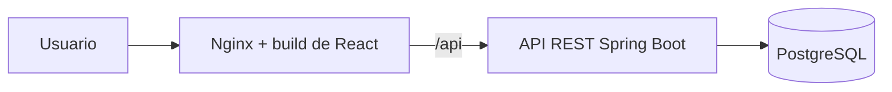

# NovaPOS

[English](README.md) | [Español](README.es.md)

NovaPOS es un sistema full stack de punto de venta, inventario, caja y control operativo para un pequeño comercio. Moderniza un flujo local real que antes dependía de una aplicación de escritorio Java Swing y hojas de cálculo, reconstruyéndolo con Spring Boot, React, PostgreSQL, Docker y un modelo documentado de despliegue local.

## Vista previa

| Dashboard del administrador | Registro de venta |
| --- | --- |
|  |  |

| Cuentas por cobrar | Cierre de caja |
| --- | --- |
|  |  |

| Corte de proveedor | Registro de mercancía |
| --- | --- |
|  |  |

## Por qué importa

Las tiendas pequeñas necesitan registrar ventas de contado y fiadas, controlar existencias, administrar caja, dar seguimiento a cuentas por cobrar, recibir mercancía de proveedores y conservar históricos sin depender de hojas de cálculo dispersas o cálculos manuales.

NovaPOS centraliza esos flujos en una aplicación web local que puede ejecutarse con Docker en la computadora de la tienda. Las operaciones principales funcionan localmente mientras Docker Desktop y los contenedores estén activos; la consulta externa opcional por código de barras requiere Internet.

## Puntos técnicos destacados

- Migra un flujo POS real desarrollado en Java Swing hacia una arquitectura web con API REST y frontend React.
- Usa un backend Spring Boot con arquitectura en capas organizada por funcionalidades, DTOs, servicios, repositorios, MapStruct, Bean Validation, Flyway, servicios transaccionales y manejo global de errores.
- Usa un frontend React y TypeScript organizado por funcionalidades, con separación de dominio, aplicación, infraestructura y UI, además de hooks, casos de uso, repositorios, Material UI, AG Grid, React Hook Form, Zod y Axios.
- Aplica autenticación JWT, autorización `ADMIN`/`CASHIER`, cambio obligatorio de contraseña y permisos controlados por el backend.
- Modela ventas, devoluciones, cancelaciones, movimientos de inventario, sesiones de caja, cuentas por cobrar, entradas de proveedor y cortes de proveedor.
- Soporta búsqueda por código de barras con productos locales y consulta opcional a Open Food Facts para códigos numéricos no registrados.
- Conserva snapshots históricos de ventas y proveedores para que los registros pasados no se recalculen con precios actuales.
- Incluye ejecución local con Docker, despliegue local de producción con Nginx, respaldo/restauración de PostgreSQL, Swagger/OpenAPI en desarrollo y pruebas backend automatizadas.

## Funcionalidades principales

- Ventas de contado y fiadas con búsqueda de productos por código de barras.
- Búsqueda local por código de barras primero; sugerencias opcionales de Open Food Facts para nombre, marca y presentación al crear productos o registrar mercancía.
- Catálogo de productos, categorías, stock, bajo stock, movimientos de inventario y relación producto-proveedor.
- Apertura de caja, entradas, salidas, cálculo de efectivo esperado, cierre e historial de sesiones.
- Administración de clientes, cuentas por cobrar, registro de abonos, saldos e historial de pagos.
- Inventario inicial de proveedor, registro de mercancía, cortes en borrador/finalizados, importación histórica y exportación a Excel.
- Dashboard por rol con ventas diarias, totales contado/crédito, cuentas por cobrar, bajo stock, cajas abiertas y ventas recientes.
- Administración de usuarios, usuarios activos/inactivos, cambio de contraseña y flujos administrativos protegidos.

La integración con Open Food Facts tiene alcance limitado de forma intencional: NovaPOS no crea productos automáticamente desde datos externos. Solo propone valores editables, evita duplicados cuando el producto ya existe localmente y permite captura manual si el servicio externo no está disponible.

## Tecnologías

| Área | Tecnologías |
| --- | --- |
| Backend | Java 17, Spring Boot 4.1.0, Spring Web MVC, Spring Data JPA, Spring Security, JJWT, Flyway, MapStruct, Bean Validation, Springdoc OpenAPI, JUnit, Spring Boot Test, Mockito |
| Frontend | React 19, TypeScript, Vite, Material UI, AG Grid, React Hook Form, Zod, Axios, Oxlint |
| Base de datos | PostgreSQL 16 |
| Infraestructura | Docker, Docker Compose, Nginx Alpine, scripts operativos de PowerShell |
| Procesamiento de archivos | Apache POI para importación histórica y exportación a Excel de cortes de proveedor |

## Arquitectura

NovaPOS es un monorepo con backend Spring Boot, frontend React, configuración Docker, scripts operativos y documentación. El backend está organizado por funcionalidades con capas de controlador, servicio, repositorio, entidad, DTO, mapper y excepciones. El frontend utiliza una arquitectura por funcionalidades inspirada en principios de Clean Architecture, con separación entre dominio, aplicación, infraestructura e interfaz de usuario.

Las reglas y cálculos de negocio viven en el backend; el frontend consume los resultados mediante este flujo:

```text
UI -> Hook -> Use Case -> Repository -> HTTP Client
```


```mermaid
flowchart LR
    User[Usuario] --> Nginx[Nginx + build de React]
    Nginx -->|/api| Backend[API REST Spring Boot]
    Backend --> Database[(PostgreSQL)]
```

Para más contexto técnico, consulta la [arquitectura](docs/architecture.md), [backend](docs/backend.md), [frontend](docs/frontend.md), [base de datos](docs/database.md) y [decisiones técnicas](docs/technical-decisions.md).

## Roles y reglas de negocio

| Rol | Alcance |
| --- | --- |
| `ADMIN` | Administra usuarios, catálogos, inventario, proveedores, reportes, historial de sesiones de caja, cuentas por cobrar y operaciones administrativas. |
| `CASHIER` | Opera flujos permitidos de caja, ventas, clientes y acciones autorizadas por el backend. No accede a proveedores, reportes administrativos ni inventario administrativo. |

El backend es la fuente de verdad para permisos mediante Spring Security. Las protecciones de rutas del frontend mejoran la navegación, pero la autorización de negocio se aplica del lado del servidor.

Las reglas principales incluyen caja abierta para ventas de contado y abonos, cliente obligatorio para ventas fiadas, límite de abonos contra saldo pendiente, restauración de inventario mediante devoluciones/cancelaciones, cortes de proveedor finalizados no editables y snapshots históricos que no se recalculan con precios actuales.

## Inicio rápido

Crea el archivo `.env` de la raíz a partir de `.env.example` y reemplaza credenciales de base de datos/JWT antes de usar datos reales. Las variables principales incluyen `DB_NAME`, `DB_USER`, `DB_PASSWORD`, `JWT_SECRET`, `JWT_EXPIRATION_MINUTES`, `SPRING_PROFILES_ACTIVE`, `VITE_API_BASE_URL`, `BOOTSTRAP_ADMIN_*` y `OPEN_FOOD_FACTS_*`.

### Desarrollo

```bash
docker compose up -d db
cd pos-backend
./mvnw spring-boot:run -Dspring-boot.run.profiles=dev
```

```bash
cd pos-frontend
npm ci
npm run dev
```

### Stack completo de desarrollo con Docker

```bash
cp .env.example .env
docker compose -f docker-compose.yml -f docker-compose.dev.yml up -d --build
```

| Servicio | URL |
| --- | --- |
| Frontend | `http://localhost:5173` |
| URL base de la API | `http://localhost:8080/api` |
| PostgreSQL | `localhost:5433` |
| pgAdmin | `http://localhost:5051` |

La configuración completa está en [Desarrollo local](docs/development.md). La operación local de producción en Windows está documentada en la [guía de despliegue](docs/store-deployment.md).

## Documentación de API

Swagger UI y OpenAPI están disponibles únicamente con el perfil backend `dev`.

| Recurso | URL |
| --- | --- |
| Swagger UI | `http://localhost:8080/swagger-ui.html` |
| OpenAPI JSON | `http://localhost:8080/v3/api-docs` |

Consulta [API](docs/api.md) para grupos de endpoints, autenticación, paginación y formato de errores.

## Pruebas y verificación

Las pruebas backend cubren servicios y controladores para ventas, movimientos de caja, sesiones de caja, movimientos de inventario, cuentas por cobrar, abonos, resúmenes del dashboard, reportes, proveedores y exportación a Excel de cortes de proveedor.

```bash
cd pos-backend
./mvnw clean verify
```

La verificación frontend usa lint y build de producción.

```bash
cd pos-frontend
npm run lint
npm run build
```

Limitaciones actuales: no hay pruebas automatizadas frontend, pruebas end-to-end, CI ni reportes de cobertura.

## Documentación

- [Índice de documentación](docs/README.md)
- [Caso de portafolio](docs/portfolio-case-study.md)
- [Arquitectura](docs/architecture.md)
- [Backend](docs/backend.md)
- [Frontend](docs/frontend.md)
- [Base de datos](docs/database.md)
- [API](docs/api.md)
- [Reglas de negocio](docs/business-rules.md)
- [Seguridad](docs/security.md)
- [Pruebas](docs/testing.md)
- [Despliegue local de producción](docs/store-deployment.md)
- [Respaldos y restauración](docs/backup-restore.md)

## Alcance y roadmap

NovaPOS está diseñado para una tienda local pequeña. No incluye soporte multi-sucursal, pagos con tarjeta/en línea, funcionamiento PWA u offline del navegador, despliegue cloud, refresh tokens, MFA, rate limiting ni monitoreo avanzado. Los datos históricos importados pueden conservar inconsistencias provenientes de hojas de cálculo heredadas.

Mejoras planeadas: impresión de tickets, pruebas frontend automatizadas, pruebas end-to-end, GitHub Actions y endurecimiento de seguridad operativa.

## Aplicación de escritorio anterior

NovaPOS es una migración y rediseño del [sistema de punto de venta original en Java Swing](https://github.com/AngelicaGuerOl/PointOfSaleSystem).

## Licencia

Este repositorio no incluye una licencia open source. El código fuente se publica únicamente para revisión de portafolio y evaluación técnica. No se autoriza su reutilización, redistribución, modificación ni uso comercial sin permiso explícito de la autora.

## Autoría

Desarrollado por [AngelicaGuerOl](https://github.com/AngelicaGuerOl).
