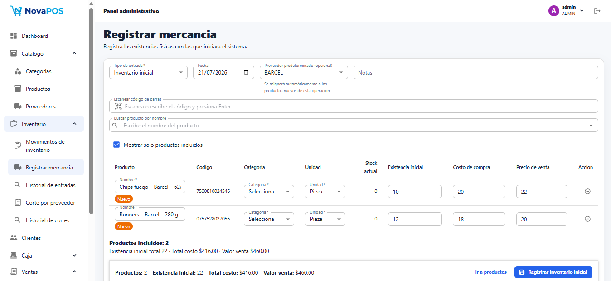
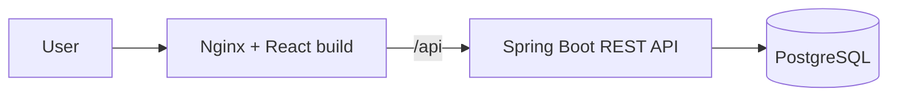

# NovaPOS

[English](README.md) | [Español](README.es.md)

NovaPOS is a full-stack point-of-sale, inventory, and store operations system for a family-owned shop or small retail business. It modernizes a local workflow that previously depended on a Java Swing desktop application and spreadsheets by rebuilding it with Spring Boot, React, PostgreSQL, and Docker.

Current status: functional application under active development. The project currently includes the main store workflows, local Docker deployment, PowerShell operation scripts, automated backend tests, frontend lint/build verification, and technical documentation.

## Application Preview

| Administrator Dashboard | Sale Registration |
| --- | --- |
|  |  |

| Accounts Receivable | Cash Closing |
| --- | --- |
|  |  |

### Supplier Settlement


### Inventory Receiving



## Problem It Solves

Small stores often need to register sales, control stock, manage cash sessions, track credit sales, receive payments, and manage supplier merchandise without relying on scattered spreadsheets or manual calculations. NovaPOS centralizes these workflows in a local web application that can run on a store computer with Docker.

NovaPOS runs its frontend, backend, and database locally through Docker. Core store operations do not require an Internet connection while Docker Desktop and the containers are running. Nginx serves the React build and proxies `/api` to the Spring Boot backend, while PostgreSQL stores operational data locally. The application is not a PWA and cannot operate when its local services are stopped.

## Highlights

- Migrates a Java Swing POS workflow into a web architecture with a REST API and React frontend.
- Uses a feature-oriented Spring Boot backend with DTOs, services, repositories, MapStruct, Bean Validation, Flyway, and global error handling.
- Uses a feature-based React and TypeScript frontend with hooks, use cases, repositories, Material UI, AG Grid, React Hook Form, and Zod.
- Applies JWT authentication, role-based authorization, forced password-change handling, and backend-enforced business permissions.
- Handles transactional sales, inventory movements, cash sessions, accounts receivable, inventory receiving, and supplier settlements.
- Supports barcode lookup with local products and optional Open Food Facts lookup when a product is not registered locally.
- Includes local Docker execution, local production deployment with Nginx, PostgreSQL backup and restore procedures, Swagger/OpenAPI in development, and automated backend tests.

## Main Features

### Sales and Inventory

- Cash and credit sales with barcode product lookup.
- Barcode lookup first checks the local catalog and can optionally query Open Food Facts for unregistered numeric barcodes.
- Open Food Facts results are used as editable suggestions for product name, brand, and presentation during product creation and inventory receiving.
- Sale history, sale details, cancellations, and product returns.
- Stock updates through sales, returns, cancellations, supplier entries, supplier settlements, and manual inventory movements.
- Product catalog with categories, prices, stock, minimum stock, active status, supplier relationships, and low-stock dashboard visibility.

The external barcode lookup is intentionally limited. NovaPOS does not create products automatically from Open Food Facts; it only suggests data that the operator can review and edit before saving. If the product already exists locally, the system reports the existing product instead of creating a duplicate. If the external service is unavailable or the barcode is not found, the product can still be captured manually. This lookup requires Internet access, but the core local POS workflows continue to run without Internet while Docker Desktop and the local containers are active.

### Cash Management

- Cash session opening for store operators.
- Manual cash inflows and outflows.
- Current cash summary, expected cash calculation, cash closing, and cash session history.
- Closed sessions preserve historical totals, counted cash, differences, notes, and processed operations.

### Customers and Credit

- Customer management for cash and credit workflows.
- Credit sales generate accounts receivable.
- Pending balances, customer account details, payment registration, and payment history.
- Receivable adjustments through returns or allowed cancellations.

### Suppliers

- Supplier management and product-supplier relationships.
- Supplier opening inventory, inventory receiving, historical entry details, and supplier settlements.
- Draft and finalized settlements, historical import support, and Excel export for finalized settlements.
- Settlement formula:

```text
Amount to justify = opening inventory + merchandise received - final inventory
```

Historical supplier values are preserved and are not recalculated using current product prices.

### Administration and Security

- `ADMIN` and `CASHIER` roles.
- JWT authentication and backend role authorization.
- User management, active/inactive users, password changes, and a forced password-change flow.
- Swagger UI enabled only for the development profile.

### Dashboard and Reports

- Role-aware dashboard for `ADMIN` and `CASHIER` users.
- Daily sales summary, cash and credit totals, accounts receivable summary, low-stock products, open cash sessions, and recent sales.
- Operations report endpoint and report page for administrative review.

### Local Operation

- Docker Compose development stack.
- Local production stack with PostgreSQL, Spring Boot, a React build served by Nginx, and only the frontend published to the host.
- PowerShell scripts for installation, start, stop, status, logs, backup, restore, update, and shortcut creation.
- PostgreSQL `.dump` backups created with `pg_dump -Fc` and restored with `pg_restore`.

## Current Limitations

- Automated frontend and end-to-end tests are not configured.
- Continuous integration (CI) is not configured.
- The application does not provide PWA or browser-offline behavior.
- The current deployment is designed for a single local store.

## Technology Stack

| Area | Confirmed technologies |
| --- | --- |
| Backend | Java 17, Spring Boot 4.1.0, Spring Web MVC, Spring Data JPA, Spring Security, JWT with JJWT 0.13.0, PostgreSQL, Flyway, MapStruct 1.6.3, Bean Validation, Springdoc OpenAPI 3.0.3, JUnit, Spring Boot Test, and Mockito. |
| Frontend | React 19.2.7, TypeScript 6.0.2, Vite 8.1.1, Material UI 9.2.0, AG Grid 36.0.0, React Hook Form 7.81.0, Zod 4.4.3, Axios 1.18.1, and Oxlint. |
| Infrastructure | Docker, Docker Compose, PostgreSQL 16, Nginx 1.27 Alpine for local production deployment, and PowerShell for Windows operation scripts. |
| File processing | Apache POI 5.4.1 for historical import and supplier settlement Excel export. |

## Architecture

NovaPOS is a monorepo containing a Spring Boot backend, React frontend, Docker configuration, operation scripts, and documentation. The backend is organized by feature with controller, service, repository, entity, DTO, mapper, and exception layers. The frontend is also feature-based and separates domain, application, infrastructure, and UI responsibilities.

Business calculations are handled by the backend. The frontend consumes results through this flow:

```text
UI -> Hook -> Use Case -> Repository -> HTTP Client
```



In development, PostgreSQL can run in Docker while the backend and frontend run directly with Maven and Vite. In the local production environment, Docker Compose starts `db`, `backend`, and `frontend`; only Nginx publishes a host port.

## User Roles

| Role | Confirmed scope |
| --- | --- |
| `ADMIN` | Manages users, catalogs, inventory, suppliers, reports, cash session history, accounts receivable, and administrative operations. |
| `CASHIER` | Operates permitted cash workflows, sales, customers, and backend-authorized actions. It does not have access to suppliers, administrative reports, or administrative inventory. |

The backend is the source of truth for permissions through Spring Security. Frontend route guards only improve navigation and user experience.

## Core Business Rules

- Cash sales require an open cash session.
- Credit sales require a customer and generate accounts receivable.
- Payments require an open cash session and cannot exceed the outstanding balance.
- Returns and cancellations restore inventory according to the corresponding business operation.
- Sales with returns cannot be cancelled, and credit sales with payments cannot be cancelled.
- Closed cash sessions cannot receive new operations.
- Finalized supplier settlements cannot be edited.
- Historical sale and supplier snapshots are not recalculated using current product prices.

## Getting Started

Docker Compose reads configuration from the root `.env` file, created from `.env.example`. Replace database and JWT credentials before real use, and never commit secrets. Direct Maven and Vite execution may require environment variables or project-specific configuration, as explained in [Local development](docs/development.md).

Key variables include `DB_NAME`, `DB_USER`, `DB_PASSWORD`, `JWT_SECRET`, `JWT_EXPIRATION_MINUTES`, `SPRING_PROFILES_ACTIVE`, `VITE_API_BASE_URL`, `BOOTSTRAP_ADMIN_*`, and `OPEN_FOOD_FACTS_*`.

For a real installation, generate `JWT_SECRET` with a random Base64 value such as `openssl rand -base64 32`. The `BOOTSTRAP_ADMIN_*` variables create the initial active `ADMIN` user only when no active administrator exists; use a strong temporary password and change it after the first login.

### Development

Start PostgreSQL:

```bash
docker compose up -d db
```

Start the backend:

```bash
cd pos-backend
./mvnw spring-boot:run -Dspring-boot.run.profiles=dev
```

Start the frontend:

```bash
cd pos-frontend
npm ci
npm run dev
```

For direct backend and frontend execution, ensure the required environment configuration is available as described in the development guide.

### Complete Development Stack With Docker

```bash
cp .env.example .env
docker compose -f docker-compose.yml -f docker-compose.dev.yml up -d --build
```

Windows PowerShell:

```powershell
Copy-Item .env.example .env
docker compose -f docker-compose.yml -f docker-compose.dev.yml up -d --build
```

| Service | URL |
| --- | --- |
| Frontend | `http://localhost:5173` |
| API base URL | `http://localhost:8080/api` |
| PostgreSQL | `localhost:5433` |
| pgAdmin | `http://localhost:5051` |

Useful Docker commands:

```bash
docker compose -f docker-compose.yml -f docker-compose.dev.yml ps
docker compose -f docker-compose.yml -f docker-compose.dev.yml logs -f backend
docker compose -f docker-compose.yml -f docker-compose.dev.yml down
```

For Windows store operation with local production containers, use the [local production deployment guide](docs/store-deployment.md).

## API Documentation

Swagger UI and OpenAPI endpoints are available only when the backend runs with the `dev` profile.

| Resource | URL |
| --- | --- |
| Swagger UI | `http://localhost:8080/swagger-ui.html` |
| OpenAPI JSON | `http://localhost:8080/v3/api-docs` |
| OpenAPI YAML | `http://localhost:8080/v3/api-docs.yaml` |

Authenticate through `POST /api/auth/login`, then use the returned JWT with the configured Bearer authentication scheme. Full request and response contracts, validation metadata, and error responses are available through Swagger UI and the OpenAPI JSON/YAML endpoints.

## Testing

Backend tests cover service and controller behavior for sales, cash movements, cash sessions, inventory movements, accounts receivable, payments, dashboard summaries, reports, suppliers, and supplier settlement Excel export.

```bash
cd pos-backend
./mvnw clean verify
```

Frontend verification uses linting and production build checks.

```bash
cd pos-frontend
npm run lint
npm run build
```

The project currently does not include automated frontend tests, end-to-end tests, CI, or coverage reporting.

## Documentation

- [Technical documentation index](docs/README.md)
- [Architecture](docs/architecture.md)
- [Backend](docs/backend.md)
- [Frontend](docs/frontend.md)
- [Database](docs/database.md)
- [API](docs/api.md)
- [Business rules](docs/business-rules.md)
- [Security](docs/security.md)
- [Local development](docs/development.md)
- [Testing](docs/testing.md)
- [User guide — Spanish](docs/user-guide.md)
- [Local production deployment — Spanish](docs/store-deployment.md)
- [Backup and restore — Spanish](docs/backup-restore.md)
- [Technical decisions](docs/technical-decisions.md)
- [Portfolio case study](docs/portfolio-case-study.md)
- [Legacy import](docs/legacy-import.md)

## Repository Structure

```text
.
├── pos-backend/
├── pos-frontend/
├── docs/
├── scripts/
├── docker-compose.yml
├── docker-compose.dev.yml
├── docker-compose.prod.yml
├── .env.example
├── README.md
└── README.es.md
```

## Project Scope

- Designed for one small retail store.
- Intended for local installation and operation.
- Supports cash and credit sales.
- Supports local PostgreSQL backup and restore procedures.
- Does not include multi-branch support.
- Does not include card or online payment integration.
- Does not provide PWA or browser-offline behavior; the local services must be running.
- Historical imported data may preserve inconsistencies from legacy spreadsheets.

## Previous Desktop Application

NovaPOS is a migration and redesign of the original [Java Swing Point of Sale System](https://github.com/AngelicaGuerOl/PointOfSaleSystem). The new version introduces a REST API, React frontend, PostgreSQL, Flyway migrations, JWT authentication, Docker Compose, local production deployment with Nginx, PowerShell operation scripts, and OpenAPI documentation.

## Roadmap

- Receipt printing.
- Automated frontend tests.
- End-to-end tests for sales, cash, and inventory.
- GitHub Actions for build and verification.
- Operational security hardening and audit improvements.

## License

This repository does not include an open-source license. The source code is published for portfolio review and technical evaluation only. Reuse, redistribution, modification, or commercial use is not authorized without explicit permission from the author.

## Author

Developed by [AngelicaGuerOl](https://github.com/AngelicaGuerOl).
