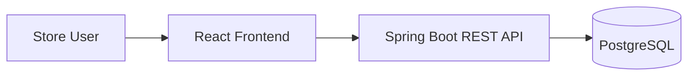

# NovaPOS

A full-stack point-of-sale system for a small retail store.

NovaPOS is a real-world POS application designed for local store operation. It manages sales, inventory, cash sessions, customer credit accounts, suppliers, and supplier merchandise settlements. The project is a migration and redesign of a previous Java Swing desktop application into a web platform built with Spring Boot, React, PostgreSQL, and Docker.

## Application Preview

| Administrator Dashboard | Sale Registration |
| --- | --- |
|  |  |

| Accounts Receivable | Cash Closing |
| --- | --- |
|  |  |

### Supplier Settlement


## Highlights

- Migrates a Java Swing POS into a modern web architecture with a REST API and React frontend.
- Uses a feature-oriented Spring Boot backend with DTOs, services, repositories, MapStruct, Bean Validation, and Flyway.
- Uses a feature-based React and TypeScript frontend with hooks, use cases, repositories, Material UI, and AG Grid.
- Applies JWT authentication, role-based authorization, and backend-protected business operations.
- Handles transactional sales, inventory, cash sessions, credit accounts, supplier entries, and supplier settlements.
- Includes Dockerized local execution, Swagger UI, OpenAPI documentation, and backend automated tests.

## Main Features

### Sales and Inventory

- Cash and credit sales with barcode product lookup.
- Sale history, sale detail, cancellations, and product returns.
- Stock updates through sales, returns, cancellations, supplier entries, and manual inventory movements.
- Product catalog with categories, prices, stock, minimum stock, active status, and low-stock detection.

### Cash Management

- Cash session opening for store operators.
- Manual cash entries and withdrawals.
- Current cash summary, expected cash calculation, cash closing, and cash session history.
- Closed sessions preserve a snapshot of the calculated totals.

### Customers and Credit

- Customer management for cash and credit workflows.
- Credit sales generate accounts receivable.
- Pending balances, customer account detail, payment registration, and payment history.

### Suppliers

- Supplier management and product-supplier relationships.
- Supplier opening inventory, merchandise entries, historical entry detail, and supplier settlements.
- Draft and finalized settlements, historical Excel import support, and Excel export for finalized settlements.
- Settlement formula:

```text
Amount to account for = opening inventory value + merchandise received value - final inventory value
```

Historical supplier values are preserved and are not recalculated using current product prices.

### Administration and Security

- ADMIN and CASHIER roles.
- JWT authentication and backend role authorization.
- User management, active/inactive users, password change, and forced password-change flow.
- Swagger UI is enabled only for the development profile.

### Dashboard and Reports

- Role-aware dashboard for ADMIN and CASHIER users.
- Daily sales summary, cash and credit totals, accounts receivable summary, low-stock products, open cash sessions, and recent sales.
- Operational report endpoint and report page for administrative review.

## Tech Stack

| Area | Technologies |
| --- | --- |
| Backend | Java 17, Spring Boot 4.1.0, Spring Security, Spring Data JPA, Hibernate, Flyway, MapStruct |
| Frontend | React 19, TypeScript, Vite, Material UI, AG Grid, React Hook Form, Zod |
| Database | PostgreSQL 16 |
| Infrastructure | Docker, Docker Compose |
| Documentation | OpenAPI, Swagger UI |
| File processing | Apache POI |

## Architecture

The backend is organized by feature with controller, service, repository, entity, DTO, mapper, and exception layers. Controllers expose HTTP contracts, services contain business rules and transaction boundaries, repositories handle persistence, and Flyway manages schema evolution. The frontend is also feature-based and separates domain, application, infrastructure, and UI responsibilities.

Business calculations are handled by the backend. The frontend consumes those results through a consistent flow:

```text
UI -> Hook -> Use Case -> Repository -> HTTP Client
```



## User Roles

| Role | Main responsibilities |
| --- | --- |
| ADMIN | Manages users, catalogs, inventory, suppliers, reports, cash sessions, and administrative operations. |
| CASHIER | Manages their cash session and performs the sales and payment operations allowed by the backend. |

## Core Business Rules

- Cash sales require an open cash session.
- Credit sales generate accounts receivable.
- Returns and cancellations restore inventory according to the corresponding business operation.
- Closed cash sessions cannot receive new operations.
- Finalized supplier settlements cannot be edited.
- Historical supplier snapshots are not recalculated with current product prices.

## Getting Started

Configuration is loaded from `.env`. The repository includes `.env.example` as the required template. Replace database and JWT credentials before real use, and never commit secrets.

Key variables include `DB_NAME`, `DB_USER`, `DB_PASSWORD`, `JWT_SECRET`, `SPRING_PROFILES_ACTIVE`, and `VITE_API_BASE_URL`.

### Development

Start PostgreSQL:

```bash
docker compose up -d db
```

Start the backend:

```bash
cd pos-backend
./mvnw spring-boot:run -Dspring-boot.run.profiles=dev
```

Start the frontend:

```bash
cd pos-frontend
npm ci
npm run dev
```

The backend can also be started from IntelliJ IDEA using the `dev` profile.

### Complete Development Stack with Docker

```bash
cp .env.example .env
docker compose -f docker-compose.yml -f docker-compose.dev.yml up -d --build
```

Windows PowerShell:

```powershell
Copy-Item .env.example .env
docker compose -f docker-compose.yml -f docker-compose.dev.yml up -d --build
```

| Service | URL |
| --- | --- |
| Frontend | `http://localhost:5173` |
| API base URL | `http://localhost:8080/api` |
| PostgreSQL | `localhost:5433` |
| pgAdmin | `http://localhost:5051` |

Useful Docker commands:

```bash
docker compose -f docker-compose.yml -f docker-compose.dev.yml ps
docker compose -f docker-compose.yml -f docker-compose.dev.yml logs -f backend
docker compose -f docker-compose.yml -f docker-compose.dev.yml down
```

## API Documentation

Swagger UI and the OpenAPI endpoints are available only when the backend runs with the `dev` profile.

| Resource | URL |
| --- | --- |
| Swagger UI | `http://localhost:8080/swagger-ui.html` |
| OpenAPI JSON | `http://localhost:8080/v3/api-docs` |
| OpenAPI YAML | `http://localhost:8080/v3/api-docs.yaml` |

Log in through `POST /api/auth/login`, copy the returned JWT, click `Authorize`, and use the token with the configured Bearer authentication scheme. The full REST contract, request examples, validation metadata, and error responses are available through Swagger UI and the OpenAPI JSON/YAML endpoints.

## Testing

Backend tests cover core service and controller behavior for sales, cash movement, cash sessions, inventory movement, receivables, payments, dashboard summaries, reports, suppliers, and supplier settlement Excel export.

```bash
cd pos-backend
./mvnw clean verify
```

Frontend verification uses linting and production build checks.

```bash
cd pos-frontend
npm run lint
npm run build
```

## Documentation

- [Technical Documentation Index](docs/README.md)
- [Architecture](docs/architecture.md)
- [Business Rules](docs/business-rules.md)
- [Database](docs/database.md)
- [Security](docs/security.md)
- [Installation Guide](docs/installation.md)
- [Testing](docs/testing.md)
- [Backup and Restore](docs/backup-restore.md)
- [Legacy Data Import](docs/legacy-import.md)

## Repository Structure

```text
.
├── pos-backend/
├── pos-frontend/
├── docs/
├── docker-compose.yml
├── docker-compose.dev.yml
├── .env.example
└── README.md
```

## Project Scope

- Designed for one small retail store.
- Intended for local installation and operation.
- Supports cash and credit sales.
- Does not include multi-branch support.
- Does not include card or online payment integration.
- Historical imported data may preserve inconsistencies from legacy spreadsheets.

## Previous Desktop Application

NovaPOS is a migration and redesign of the original [Java Swing Point of Sale System](https://github.com/AngelicaGuerOl/PointOfSaleSystem). The new version introduces a REST API, React frontend, PostgreSQL, Flyway migrations, JWT authentication, Docker Compose, and OpenAPI documentation.

## Future Improvements

- Receipt printing.
- Automated database backups.
- Frontend automated tests.
- GitHub Actions for build and verification.
- Production-optimized frontend container.

## Author

Developed by [AngelicaGuerOl](https://github.com/AngelicaGuerOl).
