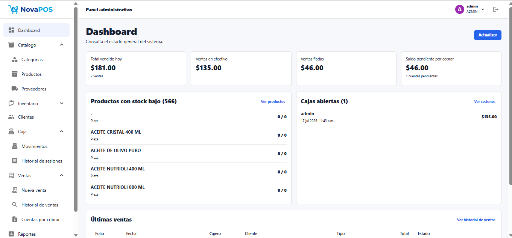
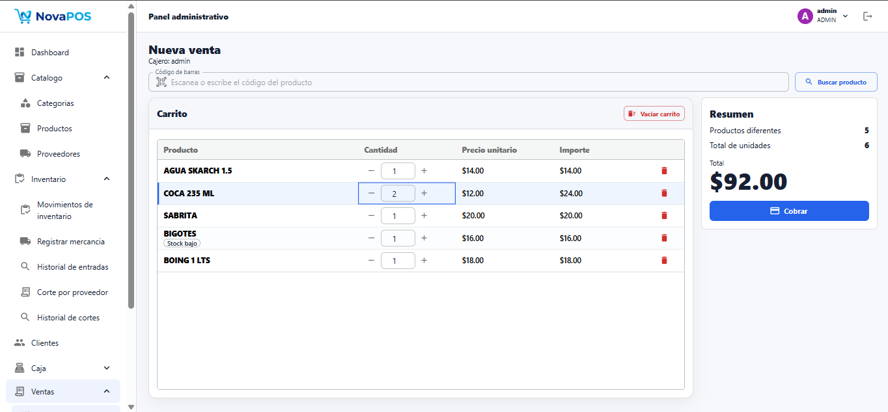
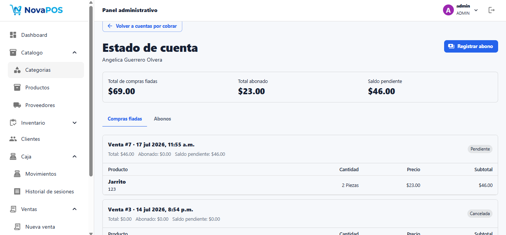
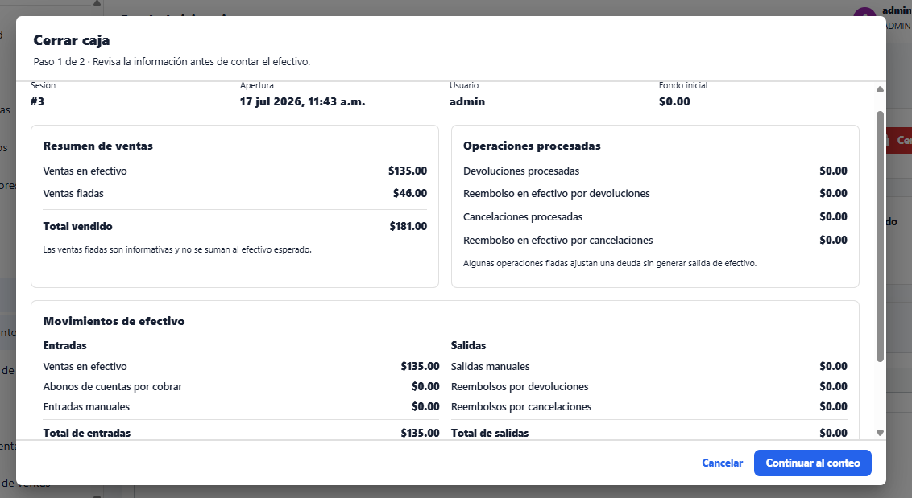
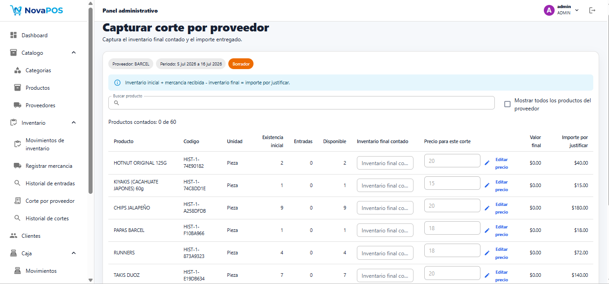
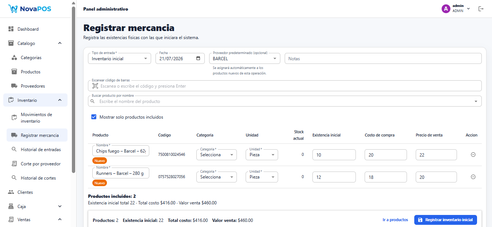
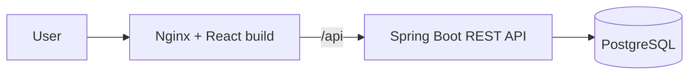

# NovaPOS

[English](README.md) | [Español](README.es.md)

NovaPOS is a full-stack point-of-sale, inventory, cash management, and operational control system for a small retail business. It modernizes a real local workflow that previously depended on a Java Swing desktop application and spreadsheets, rebuilding it with Spring Boot, React, PostgreSQL, Docker, and a documented local deployment model.

## Application Preview

| Administrator Dashboard | Sale Registration |
| --- | --- |
|  |  |

| Accounts Receivable | Cash Closing |
| --- | --- |
|  |  |

| Supplier Settlement | Inventory Receiving |
| --- | --- |
|  |  |

## Why It Matters

Small stores need to register cash and credit sales, control inventory, manage cash operations, track accounts receivable, receive supplier merchandise, and preserve historical records without depending on scattered spreadsheets or manual calculations.

NovaPOS centralizes these workflows in a local web application that can run with Docker on the store computer. The main operations work locally while Docker Desktop and the containers are running; the optional external barcode lookup requires an Internet connection.

## Technical Highlights

- Migrates a real POS workflow developed in Java Swing to a web architecture with a REST API and React frontend.
- Uses a Spring Boot backend with a feature-oriented layered architecture, DTOs, services, repositories, MapStruct, Bean Validation, Flyway, transactional services, and global error handling.
- Uses a React and TypeScript frontend organized by features, with separation between domain, application, infrastructure, and UI, as well as hooks, use cases, repositories, Material UI, AG Grid, React Hook Form, Zod, and Axios.
- Applies JWT authentication, `ADMIN`/`CASHIER` authorization, mandatory password changes, and backend-controlled permissions.
- Models sales, returns, cancellations, inventory movements, cash sessions, accounts receivable, supplier entries, and supplier settlements.
- Supports barcode lookup using local products and optional Open Food Facts queries for unregistered numeric barcodes.
- Preserves historical snapshots of sales and suppliers so previous records are not recalculated using current prices.
- Includes local Docker execution, local production deployment with Nginx, PostgreSQL backup/restore, Swagger/OpenAPI in development, and automated backend tests.

## Main Features

- Cash and credit sales with barcode product lookup.
- Local barcode lookup first; optional Open Food Facts suggestions for product name, brand, and presentation when creating products or receiving merchandise.
- Product catalog, categories, stock, low-stock visibility, inventory movements, and product-supplier relationships.
- Cash session opening, inflows, outflows, expected cash calculation, closing, and session history.
- Customer management, accounts receivable, payment registration, balances, and payment history.
- Supplier opening inventory, merchandise receiving, draft/finalized settlements, historical imports, and Excel exports.
- Role-based dashboard with daily sales, cash/credit totals, accounts receivable, low stock, open cash sessions, and recent sales.
- User management, active/inactive users, password changes, and protected administrative workflows.

The Open Food Facts integration has an intentionally limited scope: NovaPOS does not automatically create products from external data. It only suggests editable values, prevents duplicates when the product already exists locally, and allows manual entry if the external service is unavailable.

## Technologies

| Area | Technologies |
| --- | --- |
| Backend | Java 17, Spring Boot 4.1.0, Spring Web MVC, Spring Data JPA, Spring Security, JJWT, Flyway, MapStruct, Bean Validation, Springdoc OpenAPI, JUnit, Spring Boot Test, Mockito |
| Frontend | React 19, TypeScript, Vite, Material UI, AG Grid, React Hook Form, Zod, Axios, Oxlint |
| Database | PostgreSQL 16 |
| Infrastructure | Docker, Docker Compose, Nginx Alpine, PowerShell operational scripts |
| File Processing | Apache POI for historical imports and supplier settlement Excel exports |

## Architecture

NovaPOS is a monorepo with a Spring Boot backend, React frontend, Docker configuration, operational scripts, and documentation. The backend is organized by features with controller, service, repository, entity, DTO, mapper, and exception layers. The frontend uses a feature-oriented architecture inspired by Clean Architecture principles, with separation between domain, application, infrastructure, and user interface.

Business rules and calculations reside in the backend; the frontend consumes the results through this flow:

```text
UI -> Hook -> Use Case -> Repository -> HTTP Client
```


```mermaid
flowchart LR
    User[User] --> Nginx[Nginx + React build]
    Nginx -->|/api| Backend[Spring Boot REST API]
    Backend --> Database[(PostgreSQL)]
```

For more technical context, see the [architecture](docs/architecture.md), [backend](docs/backend.md), [frontend](docs/frontend.md), [database](docs/database.md), and [technical decisions](docs/technical-decisions.md).

## Roles and Business Rules

| Role | Scope |
| --- | --- |
| `ADMIN` | Manages users, catalogs, inventory, suppliers, reports, cash session history, accounts receivable, and administrative operations. |
| `CASHIER` | Performs permitted cash, sales, customer, and backend-authorized operations. It does not have access to suppliers, administrative reports, or administrative inventory. |

The backend is the source of truth for permissions through Spring Security. Frontend route protections improve navigation, but business authorization is enforced on the server side.

The main rules include requiring an open cash session for cash sales and payments, requiring a customer for credit sales, limiting payments to the outstanding balance, restoring inventory through returns/cancellations, preventing edits to finalized supplier settlements, and preserving historical snapshots that are not recalculated using current prices.

## Quick Start

Create the root `.env` file from `.env.example` and replace the database/JWT credentials before using real data. The main variables include `DB_NAME`, `DB_USER`, `DB_PASSWORD`, `JWT_SECRET`, `JWT_EXPIRATION_MINUTES`, `SPRING_PROFILES_ACTIVE`, `VITE_API_BASE_URL`, `BOOTSTRAP_ADMIN_*`, and `OPEN_FOOD_FACTS_*`.

### Development

```bash
docker compose up -d db
cd pos-backend
./mvnw spring-boot:run -Dspring-boot.run.profiles=dev
```

```bash
cd pos-frontend
npm ci
npm run dev
```

### Complete Development Stack with Docker

```bash
cp .env.example .env
docker compose -f docker-compose.yml -f docker-compose.dev.yml up -d --build
```

| Service | URL |
| --- | --- |
| Frontend | `http://localhost:5173` |
| API Base URL | `http://localhost:8080/api` |
| PostgreSQL | `localhost:5433` |
| pgAdmin | `http://localhost:5051` |

The complete configuration is available in [Local Development](docs/development.md). Local production operation on Windows is documented in the [deployment guide](docs/store-deployment.md).

## API Documentation

Swagger UI and OpenAPI are available only with the backend `dev` profile.

| Resource | URL |
| --- | --- |
| Swagger UI | `http://localhost:8080/swagger-ui.html` |
| OpenAPI JSON | `http://localhost:8080/v3/api-docs` |

See [API](docs/api.md) for endpoint groups, authentication, pagination, and error format.

## Testing and Verification

Backend tests cover services and controllers for sales, cash movements, cash sessions, inventory movements, accounts receivable, payments, dashboard summaries, reports, suppliers, and supplier settlement Excel exports.

```bash
cd pos-backend
./mvnw clean verify
```

Frontend verification uses linting and production builds.

```bash
cd pos-frontend
npm run lint
npm run build
```

Current limitations: there are no automated frontend tests, end-to-end tests, CI, or coverage reports.

## Documentation

- [Documentation Index](docs/README.md)
- [Portfolio Case Study](docs/portfolio-case-study.md)
- [Architecture](docs/architecture.md)
- [Backend](docs/backend.md)
- [Frontend](docs/frontend.md)
- [Database](docs/database.md)
- [API](docs/api.md)
- [Business Rules](docs/business-rules.md)
- [Security](docs/security.md)
- [Testing](docs/testing.md)
- [Local Production Deployment](docs/store-deployment.md)
- [Backup and Restore](docs/backup-restore.md)

## Scope and Roadmap

NovaPOS is designed for a small local store. It does not include multi-branch support, card/online payments, browser PWA or offline operation, cloud deployment, refresh tokens, MFA, rate limiting, or advanced monitoring. Imported historical data may preserve inconsistencies from legacy spreadsheets.

Planned improvements: receipt printing, automated frontend tests, end-to-end tests, GitHub Actions, and operational security hardening.

## Previous Desktop Application

NovaPOS is a migration and redesign of the [original Java Swing point-of-sale system](https://github.com/AngelicaGuerOl/PointOfSaleSystem).

## License

This repository does not include an open-source license. The source code is published only for portfolio review and technical evaluation. Its reuse, redistribution, modification, or commercial use is not authorized without the author's explicit permission.

## Authorship

Developed by [AngelicaGuerOl](https://github.com/AngelicaGuerOl).
