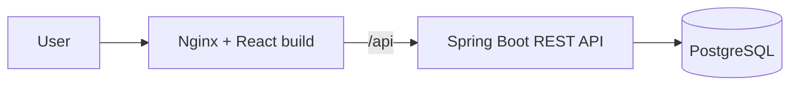

# NovaPOS

[English](README.md) | [Español](README.es.md)

NovaPOS is a full-stack point-of-sale, inventory, cash, and store operations system for a small retail business. It modernizes a real local workflow that previously depended on a Java Swing desktop application and spreadsheets, rebuilding it with Spring Boot, React, PostgreSQL, Docker, and a documented local deployment model.

Current status: functional portfolio project under active development. It includes the main store workflows, JWT authentication, role-based authorization, local Docker deployment, PowerShell operation scripts, automated backend tests, frontend lint/build verification, and technical documentation.

## Application Preview

| Administrator Dashboard | Sale Registration |
| --- | --- |
|  |  |

| Accounts Receivable | Cash Closing |
| --- | --- |
|  |  |

| Supplier Settlement | Inventory Receiving |
| --- | --- |
|  |  |

## Why This Project Matters

Small stores often need to register cash and credit sales, control stock, manage cash sessions, track accounts receivable, receive supplier merchandise, and preserve historical records without depending on scattered spreadsheets or manual calculations.

NovaPOS centralizes those workflows in a local web application that can run on a store computer with Docker. The core POS operations work locally while Docker Desktop and the containers are running; optional external barcode lookup requires Internet access.

## Technical Highlights

- Migrates a real Java Swing POS workflow into a web architecture with a REST API and React frontend.
- Uses a feature-oriented Spring Boot backend with Clean Architecture principles, DTOs, services, repositories, MapStruct, Bean Validation, Flyway, transactional services, and global error handling.
- Uses a feature-based React and TypeScript frontend with domain, application, infrastructure, and UI separation, plus hooks, use cases, repositories, Material UI, AG Grid, React Hook Form, Zod, and Axios.
- Applies JWT authentication, `ADMIN`/`CASHIER` authorization, forced password-change handling, and backend-enforced permissions.
- Models sales, returns, cancellations, inventory movements, cash sessions, accounts receivable, supplier entries, and supplier settlements.
- Supports barcode lookup with local products and optional Open Food Facts lookup for unregistered numeric barcodes.
- Preserves historical sale and supplier snapshots so past records are not recalculated with current product prices.
- Includes local Docker execution, Nginx-based local production deployment, PostgreSQL backup/restore procedures, Swagger/OpenAPI in development, and automated backend tests.

## Main Features

- Cash and credit sales with barcode product lookup.
- Local barcode lookup first; optional Open Food Facts suggestions for product name, brand, and presentation when creating products or receiving inventory.
- Product catalog, categories, stock, low-stock visibility, inventory movements, and supplier-product relationships.
- Cash session opening, inflows, outflows, expected cash calculation, closing, and session history.
- Customer management, accounts receivable, payment registration, balances, and payment history.
- Supplier opening inventory, merchandise receiving, draft/final supplier settlements, historical import support, and Excel export.
- Role-aware dashboard with daily sales, cash/credit totals, receivables, low stock, open cash sessions, and recent sales.
- User management, active/inactive users, password changes, and protected administrative workflows.

Open Food Facts integration is intentionally limited: NovaPOS does not create products automatically from external data. It only suggests editable values, avoids duplicates when a local product already exists, and allows manual capture if the external service is unavailable.

## Technology Stack

| Area | Technologies |
| --- | --- |
| Backend | Java 17, Spring Boot 4.1.0, Spring Web MVC, Spring Data JPA, Spring Security, JJWT, PostgreSQL, Flyway, MapStruct, Bean Validation, Springdoc OpenAPI, JUnit, Spring Boot Test, Mockito |
| Frontend | React 19, TypeScript, Vite, Material UI, AG Grid, React Hook Form, Zod, Axios, Oxlint |
| Infrastructure | Docker, Docker Compose, PostgreSQL 16, Nginx Alpine, PowerShell operation scripts |
| File processing | Apache POI for historical import and supplier settlement Excel export |

## Architecture

NovaPOS is a monorepo with a Spring Boot backend, React frontend, Docker configuration, operation scripts, and documentation. The backend is organized by feature with controller, service, repository, entity, DTO, mapper, and exception layers. The frontend follows a clean, feature-based structure that separates domain, application, infrastructure, and UI responsibilities.

Business rules and calculations are handled by the backend; the frontend consumes them through this flow:

```text
UI -> Hook -> Use Case -> Repository -> HTTP Client
```


```mermaid
flowchart LR
    User[User] --> Nginx[Nginx + React build]
    Nginx -->|/api| Backend[Spring Boot REST API]
    Backend --> Database[(PostgreSQL)]
```

For deeper technical context, see the [architecture](docs/architecture.md), [backend](docs/backend.md), [frontend](docs/frontend.md), [database](docs/database.md), and [technical decisions](docs/technical-decisions.md) documents.

## Roles And Business Rules

| Role | Scope |
| --- | --- |
| `ADMIN` | Manages users, catalogs, inventory, suppliers, reports, cash session history, accounts receivable, and administrative operations. |
| `CASHIER` | Operates permitted cash workflows, sales, customers, and backend-authorized actions. It does not access suppliers, administrative reports, or administrative inventory. |

The backend is the source of truth for permissions through Spring Security. Frontend route guards improve navigation, but business authorization is enforced server-side.

Core rules include open cash sessions for cash sales and payments, customer-required credit sales, payment limits against outstanding balances, inventory restoration through returns/cancellations, non-editable finalized supplier settlements, and historical snapshots that are not recalculated with current prices.

## Getting Started

Create the root `.env` file from `.env.example` and replace database/JWT credentials before using real data. Key variables include `DB_NAME`, `DB_USER`, `DB_PASSWORD`, `JWT_SECRET`, `JWT_EXPIRATION_MINUTES`, `SPRING_PROFILES_ACTIVE`, `VITE_API_BASE_URL`, `BOOTSTRAP_ADMIN_*`, and `OPEN_FOOD_FACTS_*`.

### Development

```bash
docker compose up -d db
cd pos-backend
./mvnw spring-boot:run -Dspring-boot.run.profiles=dev
```

```bash
cd pos-frontend
npm ci
npm run dev
```

### Complete Development Stack With Docker

```bash
cp .env.example .env
docker compose -f docker-compose.yml -f docker-compose.dev.yml up -d --build
```

| Service | URL |
| --- | --- |
| Frontend | `http://localhost:5173` |
| API base URL | `http://localhost:8080/api` |
| PostgreSQL | `localhost:5433` |
| pgAdmin | `http://localhost:5051` |

Detailed setup is available in [Local development](docs/development.md). Windows local production operation is documented in the [store deployment guide](docs/store-deployment.md).

## API Documentation

Swagger UI and OpenAPI endpoints are available only with the `dev` backend profile.

| Resource | URL |
| --- | --- |
| Swagger UI | `http://localhost:8080/swagger-ui.html` |
| OpenAPI JSON | `http://localhost:8080/v3/api-docs` |

See [API documentation](docs/api.md) for endpoint groups, authentication, pagination, and error format.

## Testing And Verification

Backend tests cover service and controller behavior for sales, cash movements, cash sessions, inventory movements, accounts receivable, payments, dashboard summaries, reports, suppliers, and supplier settlement Excel export.

```bash
cd pos-backend
./mvnw clean verify
```

Frontend verification uses linting and production build checks.

```bash
cd pos-frontend
npm run lint
npm run build
```

Current limitations: no automated frontend tests, no end-to-end suite, no CI, and no coverage reporting.

## Documentation

- [Documentation index](docs/README.md)
- [Portfolio case study](docs/portfolio-case-study.md)
- [Architecture](docs/architecture.md)
- [Backend](docs/backend.md)
- [Frontend](docs/frontend.md)
- [Database](docs/database.md)
- [API](docs/api.md)
- [Business rules](docs/business-rules.md)
- [Security](docs/security.md)
- [Testing](docs/testing.md)
- [Local production deployment](docs/store-deployment.md)
- [Backup and restore](docs/backup-restore.md)

## Scope And Roadmap

NovaPOS is designed for one local small retail store. It does not include multi-branch support, card or online payment integration, browser-offline/PWA behavior, cloud deployment, refresh tokens, MFA, rate limiting, or advanced monitoring. Historical imported data may preserve inconsistencies from legacy spreadsheets.

Planned improvements include receipt printing, automated frontend tests, end-to-end tests, GitHub Actions, and operational security hardening.

## Previous Desktop Application

NovaPOS is a migration and redesign of the original [Java Swing Point of Sale System](https://github.com/AngelicaGuerOl/PointOfSaleSystem).

## License

This repository does not include an open-source license. The source code is published for portfolio review and technical evaluation only. Reuse, redistribution, modification, or commercial use is not authorized without explicit permission from the author.

## Author

Developed by [AngelicaGuerOl](https://github.com/AngelicaGuerOl).
