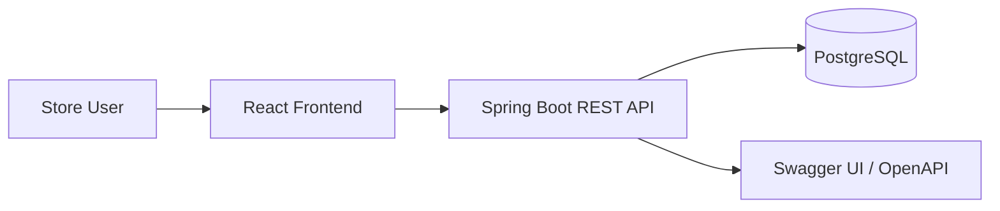
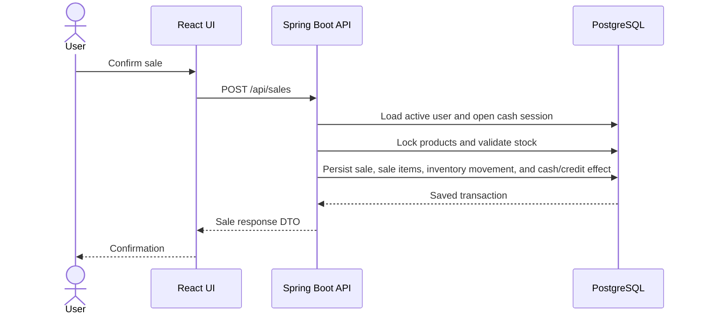

# Architecture

NovaPOS is a local-first full-stack application for small retail store operations. The system is composed of a React frontend, a Spring Boot REST API, and a PostgreSQL database. The frontend communicates with the backend through HTTP/JSON, and the backend owns the business calculations, transactional workflows, security checks, and persistence rules.

Docker Compose is used to run the local development stack. The project also supports running PostgreSQL in Docker while starting the backend from Maven or IntelliJ IDEA and the frontend from Vite.

## System Overview



The backend exposes REST endpoints under `/api`. Swagger UI and OpenAPI endpoints are available only when Springdoc is enabled through the `dev` profile. The frontend uses `VITE_API_BASE_URL` to target the API base URL.

## Backend Architecture

The backend is organized by feature. Features generally follow internal layers:

| Layer | Responsibility |
| --- | --- |
| Controller | Exposes REST endpoints, validates request DTOs, and delegates business work. |
| Service | Owns business rules, calculations, transaction boundaries, and orchestration across repositories. |
| Repository | Provides database access through Spring Data JPA queries, projections, locks, and pagination. |
| Entity | Maps database tables and relationships through JPA. |
| DTO | Defines public API contracts and keeps entities out of HTTP responses. |
| Mapper | Uses MapStruct to transform entities and DTOs. |
| Exception | Represents business and resource errors handled globally. |
| Migration | Evolves the schema through Flyway SQL scripts. |

Business logic is intentionally placed in services rather than controllers. For example, sale creation locks products, validates stock, persists sale items, updates inventory, and creates either a cash movement or an account receivable inside a transactional service operation. Supplier settlement finalization also runs in a service transaction and updates inventory through movement records.

The backend uses `@Transactional` on service methods for write workflows such as sales, returns, cancellations, receivable payments, cash closing, supplier entries, supplier opening inventory, and supplier settlement finalization. Read paths use read-only transactions when appropriate.

DTO/entity separation is enforced throughout the API. Controllers return response DTOs and accept request DTOs, while entities remain persistence objects. `GlobalExceptionHandler` centralizes error responses using `ErrorResponse` and maps validation, authentication, authorization, not-found, conflict, and internal errors to HTTP status codes.

Authentication and authorization are integrated through Spring Security, JWT filters, `AuthenticatedUser`, and role rules in `SecurityConfig`.

## Frontend Architecture

The frontend is feature-based and separates domain, application, infrastructure, and UI responsibilities. The common flow is:

```text
UI -> Hook -> Use Case -> Repository -> HTTP Client
```

| Area | Responsibility |
| --- | --- |
| Domain models | Represent frontend-facing business data. |
| Repository contracts | Define what each feature can request or mutate. |
| Use cases | Keep UI code from calling repositories directly. |
| Infrastructure repositories | Implement HTTP calls with the shared `httpClient`. |
| Mappers | Convert API DTOs to frontend domain objects. |
| Hooks | Coordinate loading, errors, submit actions, and refetching. |
| Pages and components | Render Material UI screens, dialogs, forms, and AG Grid tables. |
| Schemas | Validate forms with Zod and React Hook Form. |

Shared code lives under routing, API, UI components, formatters, storage, and page response utilities. The HTTP client attaches the Bearer token, retries selected network failures, redirects to login on unauthorized responses, and normalizes backend errors through `normalizeApiError`.

## Main Request Flow



The same design is used for other write workflows: the frontend sends the user's intent, the backend validates and calculates, and the frontend displays the returned state.

## Deployment Architecture

The verified Docker Compose services are:

| Service | Purpose |
| --- | --- |
| `db` | PostgreSQL 16 database with a persistent Docker volume. |
| `backend` | Spring Boot API running on container port `8080`. |
| `frontend` | Node 22 Alpine container running the Vite development server on port `5173`. |
| `pgadmin` | Optional database administration UI. |

The current frontend Dockerfile runs `npm run dev`. It is a development container, not a production-optimized Nginx image.

## Architectural Decisions

- Feature-oriented backend keeps business modules isolated while sharing common security, errors, and response types.
- Feature-based frontend keeps UI concerns separate from HTTP implementation details.
- Flyway manages schema evolution and Hibernate validates the schema with `ddl-auto=validate`.
- JWT keeps the API stateless.
- Backend services calculate monetary totals, stock changes, cash totals, receivable balances, and settlement results.
- Historical supplier snapshots are preserved instead of being recalculated with current product data.
- Docker Compose provides a repeatable local environment for development and review.
