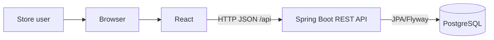
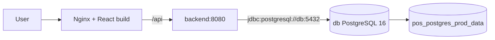
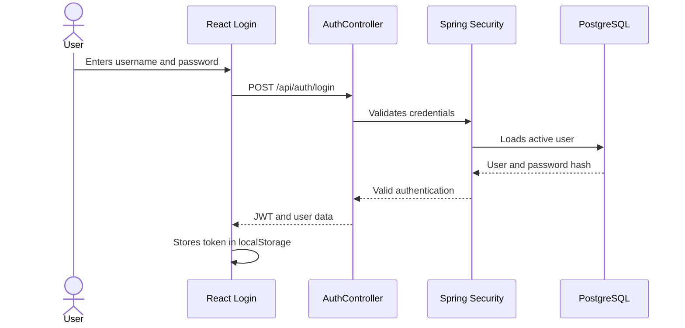
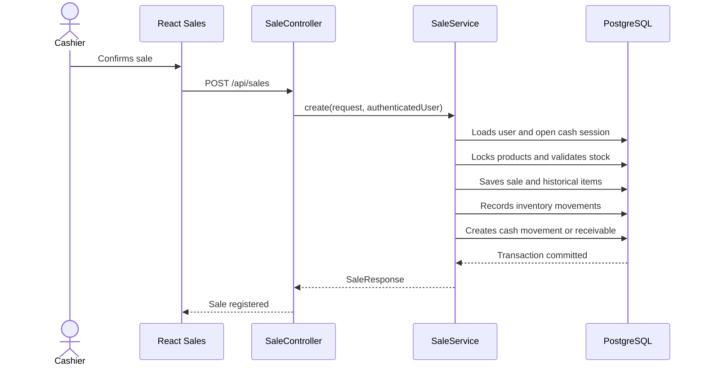
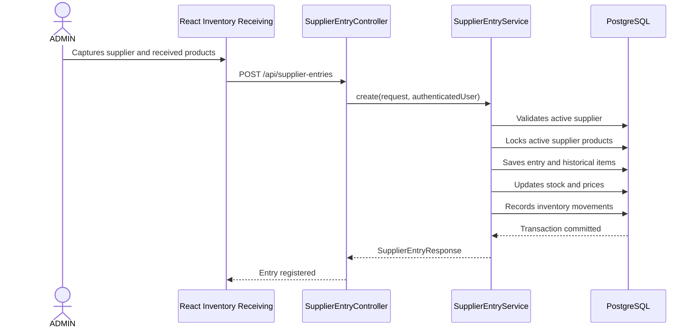

# Architecture

NovaPOS is a full-stack application for local store operations. The system combines a React frontend, a Spring Boot REST API, and PostgreSQL. The backend owns business rules, security, monetary calculations, inventory movements, cash operations, and persistence.

## System Overview



For local production deployment:



Only the `frontend` service publishes a host port. `backend` and `db` remain on the internal Docker network.

## Service Responsibilities

| Service | Responsibility |
| --- | --- |
| React | User interface for sales, cash, catalogs, accounts receivable, suppliers, inventory, reports, and users. |
| Nginx | Serves the React build in local production deployment and proxies `/api` to the backend. |
| Spring Boot | REST API, authentication, authorization, business rules, transactions, and reports. |
| PostgreSQL | Relational persistence for users, catalogs, sales, cash, inventory, suppliers, and historical audit data. |
| Flyway | Controlled schema evolution through SQL migrations. |

## Monorepo

```text
pos-backend/   Spring Boot API
pos-frontend/  React application
docs/          Technical and operational documentation
scripts/       Windows local operation scripts
```

This separation makes it possible to build and verify the backend and frontend independently while keeping shared documentation and Docker configuration in the same repository.

## Feature-Based Backend

The backend is organized by business module. Each feature includes the layers it needs:

```text
controller -> dto -> service -> repository -> entity
                         |
                      mapper
                         |
                    exception
```

Controllers receive HTTP requests and delegate. Services enforce rules, calculations, and transactions. Repositories encapsulate JPA queries, pagination, and locks. DTOs prevent direct entity exposure. MapStruct mappers transform entities and responses.

`GlobalExceptionHandler` centralizes error handling, and `ErrorResponse` normalizes error payloads.

## Feature-Based Frontend

The frontend follows this flow:

```text
Page/Component -> Hook -> Use Case -> Repository -> httpClient -> API
```

Features separate models, use cases, HTTP repositories, mappers, hooks, and UI. `shared/` contains the HTTP client, protected routes, token storage, form helpers, shared components, and formatting utilities.

## Authentication Flow



If the user has `mustChangePassword`, the frontend redirects to `/change-password` and the backend blocks business endpoints through `MustChangePasswordFilter`.

## Sale Flow



The backend calculates totals and stock changes. The frontend does not update inventory optimistically.

## Supplier Inventory Receiving Flow



## Persistence

PostgreSQL stores users, catalogs, customers, cash sessions, sales, receivables, inventory, suppliers, settlements, and historical import metadata. Flyway keeps migrations under `pos-backend/src/main/resources/db/migration`.

Hibernate is configured with `ddl-auto=validate`. The application validates the schema but does not create or modify tables automatically.

## Security

The API uses stateless JWT, BCrypt password hashing, `ADMIN` and `CASHIER` roles, authentication filters, and forced password-change handling. HTTP rules live in `SecurityConfig`, and some services add contextual checks such as cashier access to permitted sales.

## Docker And Nginx

Development:

- `docker-compose.yml` defines `db`, `backend`, `frontend`, and `pgadmin`.
- `docker-compose.dev.yml` adds frontend volumes for Vite.
- The frontend uses Vite on `5173`.
- PostgreSQL publishes the port configured by `DB_PORT`.

Local production deployment:

- `docker-compose.prod.yml` removes host ports from `db` and `backend`.
- `frontend` uses `Dockerfile.prod` and Nginx.
- `VITE_API_BASE_URL=/api` is set during the frontend build.
- Nginx uses `try_files` for React Router and proxies `/api` to `backend:8080`.
- Data lives in the `pos_postgres_prod_data` volume.

## Relevant Decisions

- Monorepo to keep backend, frontend, Docker, and documentation together.
- PostgreSQL for relational consistency and constraints.
- Flyway for auditable migrations.
- JWT for a stateless API.
- Soft delete through `active` fields where applicable to preserve historical records.
- Product and inventory separation: products store current stock, while movements preserve traceability.
- Supplier historical values are not recalculated with current prices.
