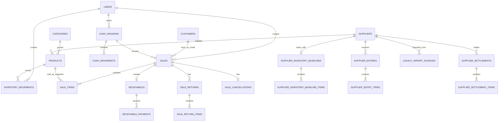

# Database

NovaPOS uses PostgreSQL with Spring Data JPA, Hibernate, and Flyway. The schema is versioned through SQL migrations in `pos-backend/src/main/resources/db/migration`.

## Configuration

- Engine: PostgreSQL 16 in Docker Compose.
- Migrations: Flyway.
- ORM validation: `spring.jpa.hibernate.ddl-auto=validate`.
- Persistence: Spring Data JPA / Hibernate.
- Local production deployment: Docker volume `pos_postgres_prod_data`.
- Development: Docker volume `pos_postgres_data`.

`ddl-auto=validate` lets Hibernate verify that entities match the schema. It does not create or modify tables automatically.

## Flyway Migrations

Confirmed migrations through `V19`:

| Migration | Purpose |
| --- | --- |
| `V1` | Core schema: users, categories, products, and customers. |
| `V2` | Forced password change. |
| `V3` | Cash sessions. |
| `V4` | Cash movements. |
| `V5` | Inventory movements. |
| `V6` | Sales and sale items. |
| `V7` | Accounts receivable. |
| `V8` | Receivable payments. |
| `V9` | Returns. |
| `V10` | Sale cancellations. |
| `V11` | Cash closing snapshot. |
| `V12` | Suppliers, entries, opening inventory, and settlements. |
| `V13` | Historical import metadata. |
| `V14`-`V18` | Historical import adjustments, tolerances, and cost review. |
| `V19` | Allows negative expected cash for historical cash-session cases. |

Rules:

- Do not modify old migrations that may already have been applied.
- Create a new versioned migration for every schema change.
- Keep SQL constraints, JPA entities, and DTO/service validations aligned.
- Test backend startup after changes because Flyway and `ddl-auto=validate` detect inconsistencies.

## Main Tables

| Domain | Tables |
| --- | --- |
| Users | `users` |
| Catalog | `categories`, `products` |
| Customers | `customers` |
| Cash | `cash_sessions`, `cash_movements` |
| Sales | `sales`, `sale_items`, `sale_cancellations`, `sale_returns`, `sale_return_items` |
| Accounts receivable | `receivables`, `receivable_payments` |
| Inventory | `inventory_movements` |
| Suppliers | `suppliers`, `supplier_inventory_baselines`, `supplier_inventory_baseline_items`, `supplier_entries`, `supplier_entry_items`, `supplier_settlements`, `supplier_settlement_items` |
| Historical import | `legacy_import_sources` |

## Summary ER Diagram



The diagram omits some `users` audit relationships to keep it readable.

## Relevant Constraints And Indexes

- `users.role` accepts `ADMIN` or `CASHIER`.
- `users.username` is unique.
- `categories.name` and `suppliers.name` are unique case-insensitively through indexes on `lower(name)`.
- `products.barcode` is unique.
- Products have checks for name, barcode, unit, prices, stock, and minimum stock.
- One open cash session per user is enforced through a partial unique index.
- Sales validate type, status, total, cash received, and change amount.
- `receivables` controls balances, payments, returns, and status values.
- Cash and inventory movements validate direction, type, amounts/quantities, and source.
- Supplier baseline is unique per supplier.
- Entry, baseline, and settlement items prevent duplicate products within the same document.
- Only one `DRAFT` settlement can exist per supplier.
- `legacy_import_sources` prevents duplicates by file, checksum, and sheet.

## Stock And Inventory

`products.current_stock` stores current stock. `inventory_movements` preserves traceability with:

- product;
- user;
- direction `IN` / `OUT`;
- movement type;
- quantity;
- previous stock;
- new stock;
- source (`source_type`, `source_id`);
- description;
- timestamp.

Stock is modified by transactional services: sales, returns, cancellations, manual entries/exits, supplier opening inventory, merchandise entries, and supplier settlement finalization.

## Sales And Accounts Receivable

Sales store product snapshots in `sale_items` to preserve the name, barcode, unit, price, and cost used at the time of sale. Credit sales create a record in `receivables`; payments are stored in `receivable_payments` and also create cash movements when applicable.

Returns can adjust cash or accounts receivable. Cancellations create their own entity instead of deleting sales.

## Cash

`cash_sessions` models opening, closing, counted cash, difference, and closing total snapshots. `cash_movements` records cash inflows and outflows, both manual and generated by sales, payments, returns, or cancellations.

## Suppliers

The supplier module separates:

- supplier catalog;
- product-supplier relationship;
- supplier opening inventory;
- historical merchandise entries;
- draft/finalized supplier settlements;
- historical price and value snapshots.

Imported historical records may preserve source inconsistencies when the model allows it, rather than recalculating everything with current values.

## Soft Delete

Users, categories, products, customers, and suppliers use active/inactive state in the current version. They are not physically deleted in order to preserve historical relationships with sales, inventory, and operations.

## Creating A New Migration

1. Check the latest version in `pos-backend/src/main/resources/db/migration`.
2. Create `V{new_version}__clear_description.sql`.
3. Add required constraints and indexes.
4. Align entities, DTOs, services, and tests.
5. Run:

```bash
cd pos-backend
./mvnw clean verify
```

6. Start the backend against a development/test database so Flyway applies the migration and Hibernate validates the schema.
