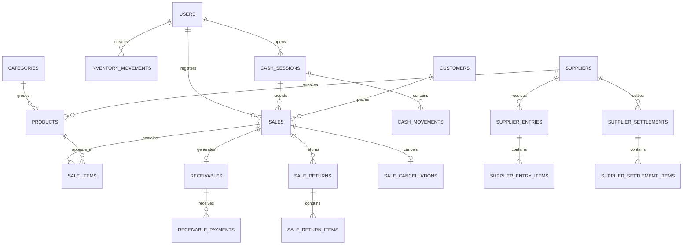

# Database

NovaPOS uses PostgreSQL with Spring Data JPA, Hibernate, and Flyway. The schema is versioned through SQL migrations under `pos-backend/src/main/resources/db/migration`, and Hibernate is configured with `spring.jpa.hibernate.ddl-auto=validate`, so the application validates the schema instead of creating or updating it automatically.

## Database Overview

- Database engine: PostgreSQL 16 in Docker Compose.
- Persistence: Spring Data JPA and Hibernate.
- Schema migrations: Flyway SQL scripts.
- Monetary values use `NUMERIC` columns with explicit precision and scale.
- Quantities use decimal columns to support fractional inventory units.
- Timestamps use timestamp columns mapped to Java date/time types.
- Most operational tables use foreign keys, status checks, numeric checks, and indexes for common lookups.

## Main Tables

| Domain | Main tables | Purpose |
| --- | --- | --- |
| Users | `users` | Authentication identity, role, active status, password state. |
| Catalog | `categories`, `products` | Product catalog, pricing, stock, category, supplier relationship. |
| Customers | `customers` | Customer records used for credit sales and receivables. |
| Cash sessions | `cash_sessions` | Cash drawer lifecycle, opening, closing, and closing snapshots. |
| Cash movements | `cash_movements` | Cash inflows/outflows from sales, payments, refunds, and manual movements. |
| Sales | `sales`, `sale_items` | Sale header and historical item snapshots. |
| Returns | `sale_returns`, `sale_return_items` | Product return records and financial impact. |
| Cancellations | `sale_cancellations` | Sale cancellation records and refund references. |
| Receivables | `receivables`, `receivable_payments` | Credit accounts, balances, payments, and status. |
| Inventory | `inventory_movements` | Stock movement audit trail. |
| Suppliers | `suppliers` | Supplier catalog and active/inactive state. |
| Supplier opening inventory | `supplier_inventory_baselines`, `supplier_inventory_baseline_items` | First historical inventory base per supplier. |
| Merchandise entries | `supplier_entries`, `supplier_entry_items` | Supplier merchandise received and historical cost/sale values. |
| Supplier settlements | `supplier_settlements`, `supplier_settlement_items` | Draft/finalized supplier settlement headers and item snapshots. |
| Legacy import | `legacy_import_sources` | Idempotency and audit information for spreadsheet import. |

## Entity Relationships

The diagram focuses on the operational relationships that are most useful to understand the system. It omits some user audit links to keep the model readable.

## Constraints and Indexes

Important verified constraints include:

- `users.role` is constrained to `ADMIN` or `CASHIER`.
- Usernames are unique.
- Category names are unique ignoring case.
- Product barcodes are unique and product names/barcodes cannot be blank.
- Products have non-negative cost, sale price, current stock, and minimum stock.
- Cash sessions have `OPEN` and `CLOSED` status values.
- A partial unique index enforces one open cash session per user.
- Sales are constrained by sale type, status, total, cash received, and change amount.
- Sale item line totals are constrained against quantity and unit price.
- Receivable balances are constrained by original, adjusted, paid, returned, and outstanding amounts.
- Inventory movements and cash movements store direction/type checks and source references.
- Supplier names are unique ignoring case.
- Supplier baselines are unique per supplier.
- Supplier entries and settlements use supplier/date/status indexes.
- Settlement drafts are unique per supplier while status is `DRAFT`.
- Legacy import sources use a unique combination of file name, checksum, and sheet name for idempotency.

Search and report paths rely on indexes for product names, categories, suppliers, statuses, timestamps, cash sessions, customers, and source references.

## Transactional Consistency

Service transactions protect multi-step operations:

- Sale creation persists sale data, updates stock, and creates cash or receivable effects together.
- Returns restore inventory and update receivable/cash refund state.
- Cancellations restore inventory and update cash or receivable state.
- Receivable payments update balances and create cash movement records.
- Cash closing stores a stable closing snapshot.
- Supplier entries update products, stock, prices, and entry records.
- Supplier settlement finalization locks records and updates stock through inventory movements.

Where concurrent updates could affect stock or closing state, repositories use locking queries such as `FOR UPDATE` through JPA locking patterns.

## Flyway Rules

- Migrations live under `pos-backend/src/main/resources/db/migration`.
- The project uses Flyway versioned names such as `V1__create_core_schema.sql`.
- Applied migrations should not be edited.
- New schema changes require new migration files.
- Hibernate validates the schema at startup but does not create or migrate it.
- Database constraints are part of the domain model and should remain consistent with entity validation and service rules.
