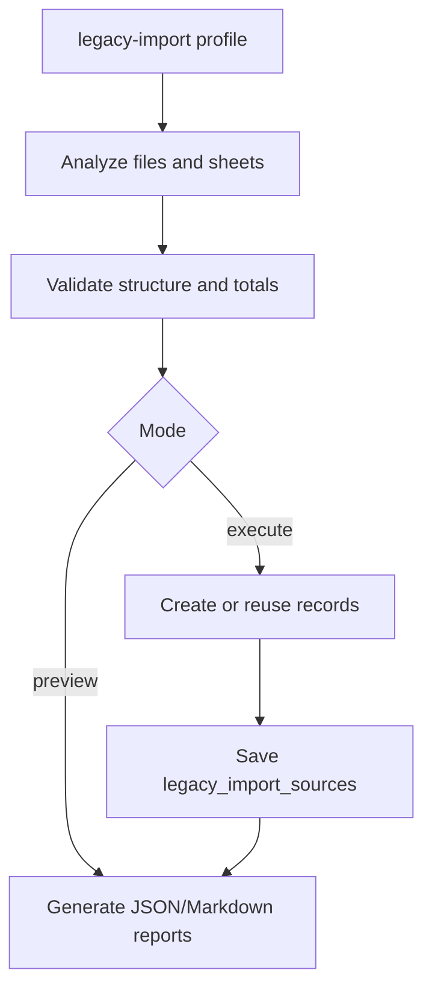

# Legacy Import

NovaPOS includes a backend-only mechanism for importing historical data from spreadsheets. This functionality is intended for controlled migration work, not automatic execution during normal store operation.

## Purpose

The import process helps preserve historical supplier records, merchandise entries, opening inventories, and settlements. It reads `.xlsx` files, analyzes sheets chronologically, creates or reuses suppliers/products, registers entries and finalized settlements, and stores audit metadata.

Real merchandise files and reports containing business data should be treated as private and should not be published.

## Execution

The import runs only with the Spring `legacy-import` profile and explicit arguments. It does not run in the normal application profile.

Conceptual example:

```bash
cd pos-backend
./mvnw spring-boot:run \
  -Dspring-boot.run.profiles=legacy-import \
  -Dspring-boot.run.arguments="--legacy.import.directory=../legacy-import --legacy.import.mode=preview --legacy.import.report=target/legacy-import-report"
```

Modes:

| Mode | Behavior |
| --- | --- |
| `preview` | Analyzes and generates reports without saving business records. |
| `execute` | Runs the import if analysis has no blocking errors. |

Use `execute` only after reviewing the preview.

## Flow



## Supported Concepts

- Supplier mapping by file.
- Historical products.
- Supplier opening inventory.
- Merchandise entries.
- Finalized supplier settlements.
- Historical prices and values.
- Unknown costs through `costKnown`.
- Historical import flags.
- Audit data in `legacy_import_sources`.

## Historical Identifiers

When a historical product does not have a current commercial barcode, the importer can generate internal codes with the `HIST-` prefix. These are migration identifiers and are not necessarily scan-ready store barcodes.

## Historical Inconsistencies

Old spreadsheets may contain differences. The importer is designed to report them and preserve context when the model allows it.

Covered cases:

- missing costs;
- normalized names;
- ambiguous products;
- formula or total differences;
- final inventory greater than available inventory;
- delivered amounts or differences not available in the source.

## Snapshots

- Historical prices and values are preserved in imported entries and settlements.
- Imported settlements are treated as finalized historical records.
- Historical settlements are not recalculated with current prices.
- The latest imported sheet can update current product stock represented by that history.

## Idempotency

`legacy_import_sources` records file name, checksum, sheet, supplier, status, timestamp, records created, warning count, and error when applicable.

The file/checksum/sheet combination prevents duplicate imports.

## Privacy

- Do not commit real spreadsheets.
- Do not publish reports generated from real data.
- Use test data for screenshots or demos.
- Store historical source files outside the public repository.
