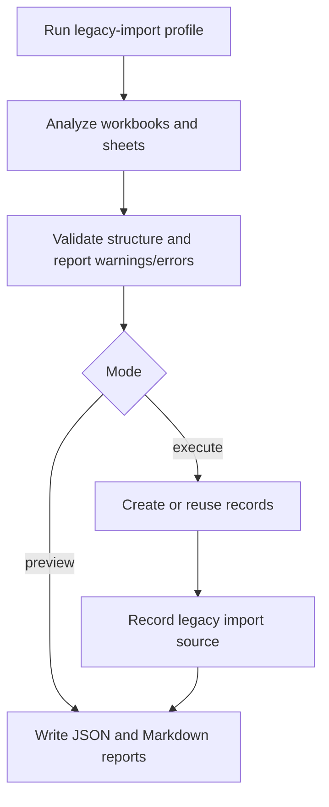

# Legacy Data Import

NovaPOS includes a backend-only historical import mechanism for migrating supplier merchandise and settlement data from legacy spreadsheets. The importer is intended for controlled migration work, not for automatic execution during normal application startup.

## Purpose

The import process helps preserve historical merchandise control records in the new system. It reads spreadsheet workbooks, analyzes sheets chronologically, creates or reuses suppliers and products, imports opening inventory, imports merchandise entries, creates finalized supplier settlements, and records import audit data.

Private spreadsheet names and business values should not be published in repository documentation.

The normal application profile does not run this importer. It is executed explicitly through the dedicated `legacy-import` profile and command-line arguments.

## Supported Historical Concepts

The importer supports:

- Suppliers mapped from an explicit filename-to-supplier configuration.
- Historical products, including generated internal identifiers.
- Supplier opening inventory.
- Merchandise entries by supplier.
- Supplier settlements.
- Historical sale prices and values.
- Unknown historical costs.
- Imported flags and source context.
- Import source audit records.

## Import Flow



At a high level:

1. The runner starts only with the `legacy-import` Spring profile.
2. The command receives a directory, mode, and optional report path.
3. The analyzer reads `.xlsx` files, evaluates formulas with Apache POI, parses sheets with recognizable date names, and sorts sheets chronologically.
4. The preview mode produces reports without saving business records.
5. The execute mode analyzes first and stops if blocking errors exist.
6. The importer creates or reuses supplier, category, product, baseline, entry, settlement, and audit records.
7. Reports are written in JSON and Markdown.

Conceptual command:

```bash
cd pos-backend
./mvnw spring-boot:run \
  -Dspring-boot.run.profiles=legacy-import \
  -Dspring-boot.run.arguments="--legacy.import.directory=../legacy-import --legacy.import.mode=preview --legacy.import.report=target/legacy-import-report"
```

Use `--legacy.import.mode=execute` only after reviewing preview output and resolving blocking errors.

The importer writes both JSON and Markdown reports. These reports are useful during migration review, but reports generated from real store data should be treated as private operational data.

## Historical Identifiers

When a product does not have a current retail barcode, the importer can create an internal barcode using the `HIST-` convention. These values are historical identifiers, not commercial barcodes, and should not be treated as scan-ready retail codes.

## Historical Inconsistencies

Legacy spreadsheets may contain inconsistencies. The importer is designed to report and preserve important historical context rather than silently rewrite history.

Handled cases include:

- Missing costs, represented through cost-known flags and zero cost values where the schema requires a numeric amount.
- Different product naming that is normalized for matching.
- Duplicate normalized product names for a supplier, treated as ambiguity.
- Formula or total differences, reported as warnings.
- Final inventory greater than available inventory, preserved as a settlement discrepancy.
- Missing delivered amount or difference, preserved as unknown when supported by the model.

Negative or inconsistent historical values may remain visible so the imported record matches the historical source as closely as possible.

## Snapshot Rules

- Historical sale prices and values are preserved on imported entries and settlement items.
- Imported finalized settlements are treated as historical records.
- Imported settlements are not recalculated using current product prices.
- The final inventory from the latest imported sheet is used to set current product stock for that imported supplier history.
- Imported records include source context through fields such as historical import flags and source file/sheet metadata.

## Idempotency and Audit

The `legacy_import_sources` table records imported file name, checksum, sheet name, supplier, status, import time, records created, warnings count, and error message.

The importer checks whether a file checksum and sheet name were already processed before importing a sheet. This prevents repeated executions from duplicating historical entries and settlements.

Execute mode still updates the latest stock for products represented by the most recent imported sheet. Review preview output carefully before execution, especially when product names are ambiguous.

## Data Privacy

- Do not commit real spreadsheets.
- Do not publish import reports containing private business data.
- Use anonymized data for portfolio screenshots or examples.
- Keep historical source files outside public repository content.
